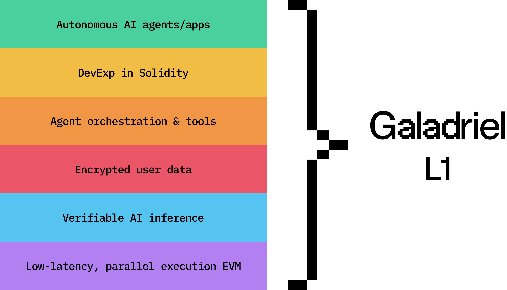
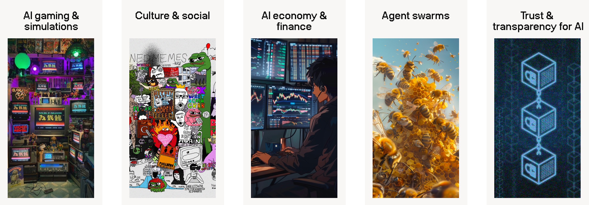

    

    Galadriel - the first Layer 1 for AI.

    

    Documentation: <a href="https://docs.galadriel.com" target="_blank">docs.galadriel.com</a>

## Overview

Galadriel is the first L1 for AI.

Ethereum enabled writing smart contracts to build dApps. Similarly, Galadriel enables developers to build AI apps & agents like smart contracts — decentralized and on-chain. We support a range of AI usage: from simple LLM features in existing dApps to highly capable AI agents like on-chain AI hedge funds, in-game AI NPCs and AI-generated NFTs.

Galadriel is built on a parallel-execution EVM stack which enables high throughput and low latency while providing a familiar experience to Solidity developers. It brings AI inference on-chain in a low-cost, low-latency manner through teeML (Trusted Execution Environment Machine Learning) which allows querying open and closed-source LLM models in a verifiable way.

Here’s a high-level overview of Galadriel L1 stack:

Read more [about Galadriel](https://docs.galadriel.com/about#what-problem-does-galadriel-solve) or [how it works](https://docs.galadriel.com/how-it-works).

## Quickstart

Please follow [this guide](https://docs.galadriel.com/quickstart) to get started with Galadriel.

## This repository

This repository contains the basic building blocks for building on top of Galadriel:

* Quickstart contracts and scripts: see the [quickstart documentation](https://docs.galadriel.com/quickstart);
* [Contract examples](/contracts/contracts) for dApps like on-chain ChatGPT, AI agents, generative-AI NFT collections;
* [End-to-end examples](/examples) of integrating Galadriel into your project;
* Oracle [contract](/contracts/contracts/ChatOracle.sol) and back-end [implementation](/oracles).

**It does not contain Galadriel's node which will be open-sourced later.**

## Use cases and example

You can build AI apps and agents natively on-chain so they are trustless, have their native currency and fully decentralized. There are promising use cases in following categories:

See more in [use cases](https://docs.galadriel.com/use-cases).

Furthermore, see example on-chain AI apps built on Galadriel:

* [On-chain ChatGPT](https://chatgpt.galadriel.com/)
* [On-chain AI game](https://vitailik.galadriel.com/)
* [On-chain Midjourney](https://minter.galadriel.com/)

## Roadmap

See our [roadmap here](https://docs.galadriel.com/roadmap).

## Getting help
If you have any questions about Galadriel, feel free to do:

* [Join our Discord](https://discord.com/invite/bHnFgSTKrP) and ask for help.
* Report bugs or feature requests in [GitHub issues](https://github.com/galadriel-ai/contracts/issues).
